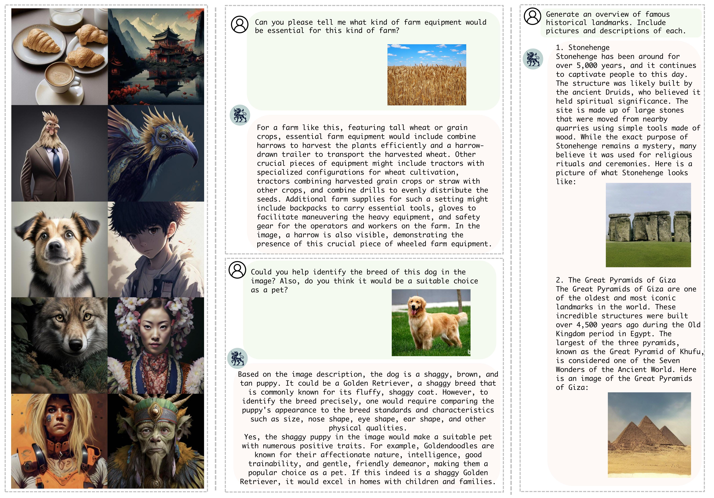
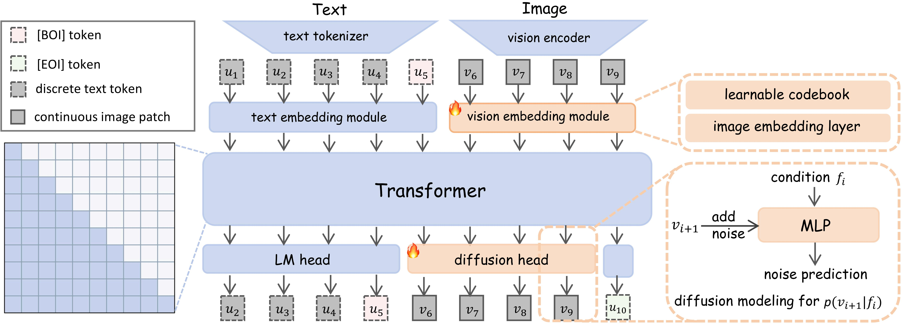
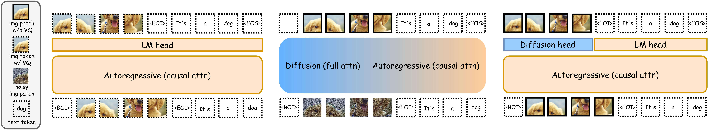

#  Orthus: Autoregressive Interleaved Image-Text Generation with Modality-Specific Heads

<p align="center">
  <a href="https://arxiv.org/abs/2412.00127"><b>📄 Paper Link</b></a> |
  <a href="#model-download"><b>📥 Model Download</b></a> |
  <a href="#usage"><b>⚡ Quick Start</b></a> |
  <a href="https://ai.meta.com/resources/models-and-libraries/chameleon-license"><b>📜 License</b></a>
</p>

**Orthus** is a unified multimodal model that copes with **discrete text tokens** and lossless **continuous image features** under the **AR** modeling principle. Unlike prior arts, Orthus simultaneously enjoys these three benefits **for the first time**:
- Unified modeling of AR and Diffusion within a single transformer
- Lossless visual signal for understanding and generation
- Seamless cross-modality learning and mix-modality generation

Orthus excels in generating images given textual prompts, answering questions based on visual inputs, and even crafting lengthy image-text interleaved contents. Here are some examples generated by Orthus.
<p align="center">
    
</p>

## Contents
- [Introduction](#introduction)
- [Model Download](#model-download)
- [Usage](#usage)
- [Acknowledgements](#acknowledgements)
- [Citation](#citation)

## Introduction
#### 🤔 How does Orthus work?
Given images and texts, Orthus embeds both discrete text tokens (from a tokenizer) and continuous patch-wise image features (from a vision encoder) into the same representation space, where an AR transformer backbone is then invoked to model the inter- and intra-modality and generates a sequence of output vectors. The vectors are routed to modality-specific heads, with the *language modeling head* to predict the next text token categorically and the *diffusion head* to predict the next image patch feature through conditional diffusion modeling. During inference, Orthus autoregressively predicts the next text token or image patch according to the indication of special transition tokens.
<p align="center">
    
</p>

#### 🧐 How does Orthus differ from existing unified multimodal models?
- Compared with fully AR models (left), Orthus (right) adopts continuous image features, eliminating information loss caused by VQ.
- Compared with AR-diffusion mixed models (middle), Orthus (right) disentangles diffusion from the transformer backbone, avoids the noise disturbance of visual understanding and renders the characterization of the correlation between modalities by straightforward AR.

<p align="center">
    
</p>

## Model Download
We release Orthus to the public, aiming to support a wider spectrum of research within the academic community. Commercial usage is
permitted under the terms outlined in [license](https://ai.meta.com/resources/models-and-libraries/chameleon-license).
| Model name               | Total parameters | Download                                                                    |
|-----------------------|-----------------|-----------------------------------------------------------------------------|
| Orthus-base | 7B            | [🤗 Hugging Face](https://huggingface.co/SJTU-Deng-Lab/Orthus-7B-base) |
| Orthus-instruct | 7B        | [🤗 Hugging Face](https://huggingface.co/SJTU-Deng-Lab/Orthus-7B-instruct)|

## Usage

### Installation
1. Environment setup:
```
conda create -n orthus python=3.11
conda activate orthus
```
2. Clone this repository and build from source:
```
git clone https://github.com/karrykkk/Orthus.git
cd Orthus
```
3. Install dependency:
```
pip install torch==2.0.1 accelerate==1.0.0 diffusers==0.31.0 numpy==1.26.4 flash-attn==2.6.3
pip install torchvision==0.15.2
cd transformers
pip install -e .
```
### Inference
For **Multimodal Understanding**, try
```
CUDA_VISIBLE_DEVICES=0 python inference/multimodal_understanding.py
```

For **Text-to-image Generation**, try
```
CUDA_VISIBLE_DEVICES=0 python inference/t2i_generation.py
```

For **Interleaved image-text Generation**, try
```
CUDA_VISIBLE_DEVICES=0 python inference/interleave_generation.py
```

## Acknowledgements
We would like to sincerely thank the developers of the open-source models [Chameleon](https://github.com/facebookresearch/chameleon) and [Anole](https://github.com/GAIR-NLP/anole), as well as the repositories [accelerate](https://github.com/huggingface/accelerate), [diffusers](https://github.com/huggingface/diffusers) and [this PR of transformers](https://github.com/leloykun/transformers/tree/fc--anole), as our work is heavily built upon these resources.

## Citation
This is the official project repository for the following paper. If you find this repository helpful, Please kindly cite:
```bibtex
@article{kou2024orthus,
  title={Orthus: Autoregressive Interleaved Image-Text Generation with Modality-Specific Heads},
  author={Kou, Siqi and Jin, Jiachun and Liu, Chang and Ma, Ye and Jia, Jian and Chen, Quan and Jiang, Peng and Deng, Zhijie},
  journal={arXiv preprint arXiv:2412.00127},
  year={2024}
}
```
