# Case Study: Test抽取十个样本

这里汇总了Test中的十个样本，便于一次性查看问题、标准答案、模型回答及对应图像。

## sample04500 — sample_4501

- 问题：What would be the resulting orientation of an object that experiences 270-degree clockwise rotation around the X-axis, followed by 90-degree clockwise rotation around the Z-axis.
- 标准答案：B
- 模型作答：D

**模型推理文本**

> This option uses incorrect rotation angles. <think>First, rotate this option clockwise along the X axis by 270 degrees. Let's generate an image to visualize the state of the object after rotation:Then, rotate this option counterclockwise along the Z axis by 90 degrees. Let's visualize the current state:Comparing the final image with the options provides the reasoning: A: This option performs extra rotations beyond the required steps. B: This option performs the rotations in wrong order. C: This option is missing one cube from the stack. D: this is the result after performing all rotation steps correctly. So the final Answer is D</think>. <Answer>D</Answer>

**标准答案组合图**

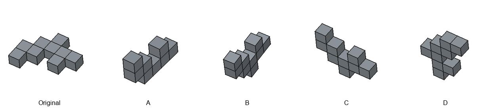

**步骤可视化**

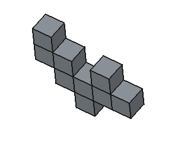
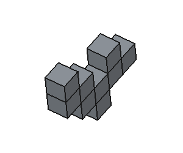

**模型生成图像**

---

## sample04550 — sample_4551

- 问题：Given the sequence of rotations 180-degree rotation around the Z-axis, followed by 90-degree clockwise rotation around the Z-axis, what is the final orientation?
- 标准答案：D
- 模型作答：C

**模型推理文本**

> >First, rotate this cube stack along the Z axis by 180 degrees. Let's generate an image to visualize the state of the object after rotation:Then, rotate this cube stack counterclockwise along the Z axis by 90 degrees. Let's visualize the current state:Comparing the final image with the options provides the reasoning: A: This option only performs partial rotations, missing some steps. B: This option performs extra rotations beyond the required steps. C: this is the result after performing all rotation steps correctly. D: This option is missing one cube from the stack. So the final Answer is C</think>. <Answer>C</Answer>

**标准答案组合图**

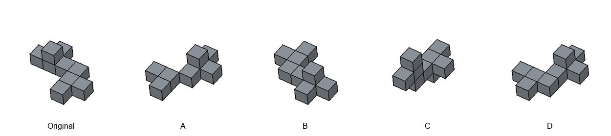

**步骤可视化**

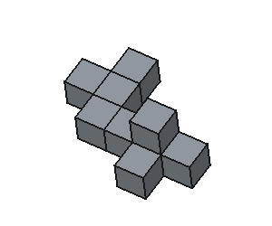
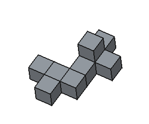

**模型生成图像**

---

## sample04600 — sample_4601

- 问题：If we start with a regular orientation and apply 90-degree clockwise rotation around the Y-axis, followed by 90-degree clockwise rotation around the Z-axis, what do we get?
- 标准答案：D
- 模型作答：D

**模型推理文本**

> . <think>First, rotate this cube stack counterclockwise along the Y axis by 90 degrees. Let's generate an image to visualize the state of the object after rotation:Then, rotate this cube stack counterclockwise along the Z axis by 90 degrees. Let's visualize the current state:Comparing the final image with the options provides the reasoning: A: This option performs extra rotations beyond the required steps. B: This option performs the rotations in wrong order. C: This option uses incorrect rotation angles. D: this is the result after performing all rotation steps correctly. So the final Answer is D</think>. <Answer>D</Answer>

**标准答案组合图**

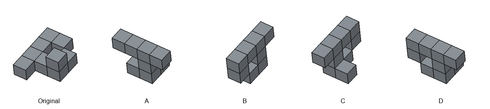

**步骤可视化**

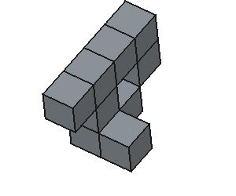
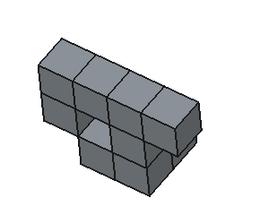

**模型生成图像**

---

## sample04650 — sample_4651

- 问题：When a shape experiences 270-degree clockwise rotation around the X-axis, followed by 270-degree clockwise rotation around the X-axis, what does it look like?
- 标准答案：B
- 模型作答：D

**模型推理文本**

> . <think>First, rotate this cube stack clockwise along the X axis by 270 degrees. Let's generate an image to visualize the state of the object after rotation:Then, rotate this cube stack clockwise along the X axis by 270 degrees. Let's visualize the current state:Comparing the final image with the options provides the reasoning: A: This option performs extra rotations beyond the required steps. B: This option rotates along wrong axes. C: This option uses incorrect rotation angles. D: this is the result after performing all rotation steps correctly. So the final Answer is D</think>. <Answer>D</Answer>

**标准答案组合图**

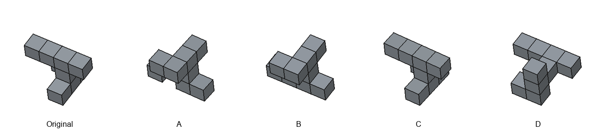

**步骤可视化**

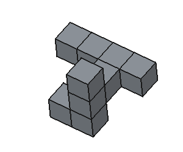
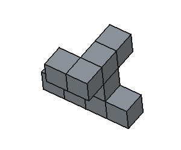

**模型生成图像**

---

## sample04700 — sample_4701

- 问题：Based on 90-degree clockwise rotation around the Y-axis, followed by 90-degree clockwise rotation around the Z-axis is applied, what final orientation do you obtain?
- 标准答案：D
- 模型作答：D

**模型推理文本**

> >First, rotate this cube stack counterclockwise along the Y axis by 90 degrees. Let's generate an image to visualize the state of the object after rotation:Then, rotate this cube stack counterclockwise along the Z axis by 90 degrees. Let's visualize the current state:Comparing the final image with the options provides the reasoning: A: This option only performs partial rotations, missing some steps. B: This option performs the rotations in wrong order. C: This option is missing one cube from the stack. D: this is the result after performing all rotation steps correctly. So the final Answer is D</think>. <Answer>D</Answer>

**标准答案组合图**

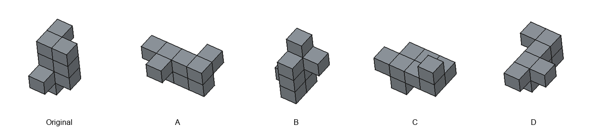

**步骤可视化**

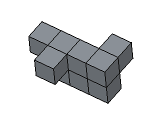
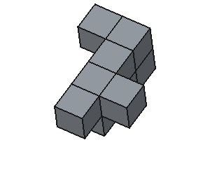

**模型生成图像**

---

## sample04750 — sample_4751

- 问题：Consider the visual outcome of 180-degree rotation around the X-axis, followed by 180-degree rotation around the Z-axis.
- 标准答案：C
- 模型作答：C

**模型推理文本**

> >First, rotate this option along the X axis by 180 degrees. Let's generate an image to visualize the state of the object after rotation:Then, rotate this option along the Z axis by 180 degrees. Let's visualize the current state:Comparing the final image with the options provides the reasoning: A: This option uses incorrect rotation angles. B: This option performs extra rotations beyond the required steps. C: this is the result after performing all rotation steps correctly. D: This option rotates along wrong axes. So the final Answer is C</think>. <Answer>C</Answer>

**标准答案组合图**

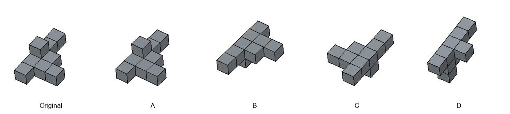

**步骤可视化**

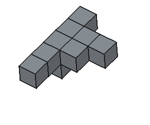
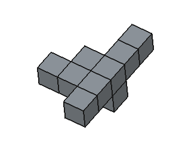

**模型生成图像**

---

## sample04800 — sample_4801

- 问题：In the event that 180-degree rotation around the Z-axis, followed by 90-degree clockwise rotation around the Z-axis, determine the resulting orientation.
- 标准答案：A
- 模型作答：D

**模型推理文本**

> >First, rotate this cube stack along the Z axis by 180 degrees. Let's generate an image to visualize the state of the object after rotation:Then, rotate this cube stack counterclockwise along the Z axis by 90 degrees. Let's visualize the current state:Comparing the final image with the options provides the reasoning: A: This option only performs partial rotations, missing some steps. B: This option performs extra rotations beyond the required steps. C: This option rotates along wrong axes. D: this is the result after performing all rotation steps correctly. So the final Answer is D</think>. <Answer>D</Answer>

**标准答案组合图**

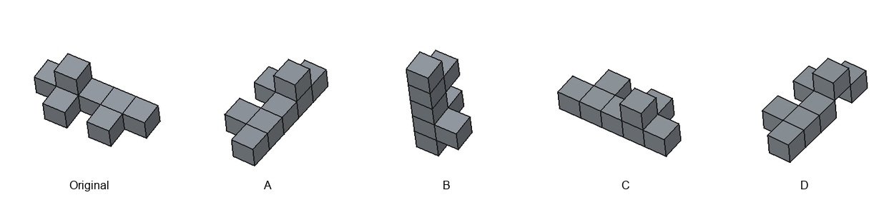

**步骤可视化**

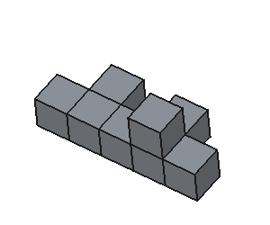
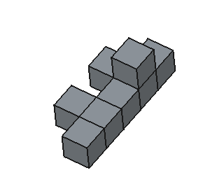

**模型生成图像**

---

## sample04850 — sample_4851

- 问题：What orientation results from performing 90-degree clockwise rotation around the Y-axis, followed by 270-degree clockwise rotation around the Y-axis?
- 标准答案：D
- 模型作答：D

**模型推理文本**

> >First, rotate this cube stack counterclockwise along the Y axis by 90 degrees. Let's generate an image to visualize the state of the object after rotation:Then, rotate this cube stack clockwise along the Y axis by 270 degrees. Let's visualize the current state:Comparing the final image with the options provides the reasoning: A: This option only performs partial rotations, missing some steps. B: This option performs extra rotations beyond the required steps. C: This option rotates along wrong axes. D: this is the result after performing all rotation steps correctly. So the final Answer is D</think>. <Answer>D</Answer>

**标准答案组合图**

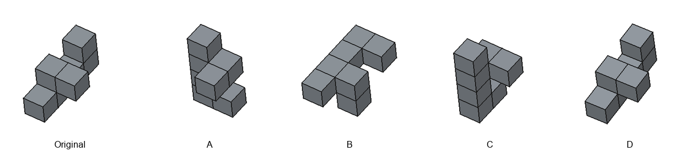

**步骤可视化**

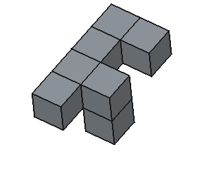
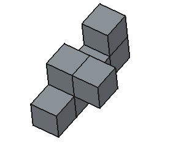

**模型生成图像**

---

## sample04900 — sample_4901

- 问题：Imagine applying 270-degree clockwise rotation around the Y-axis, followed by 180-degree rotation around the Z-axis. What orientation would result?
- 标准答案：D
- 模型作答：A

**模型推理文本**

> >First, rotate this cube stack clockwise along the Y axis by 270 degrees. Let's generate an image to visualize the state of the object after rotation:Then, rotate this cube stack along the Z axis by 180 degrees. Let's visualize the current state:Comparing the final image with the options provides the reasoning: A: this is the result after performing all rotation steps correctly. B: This option performs extra rotations beyond the required steps. C: This option only performs partial rotations, missing some steps. D: This option is missing one cube from the stack. So the final Answer is A</think>. <Answer>A</Answer>

**标准答案组合图**

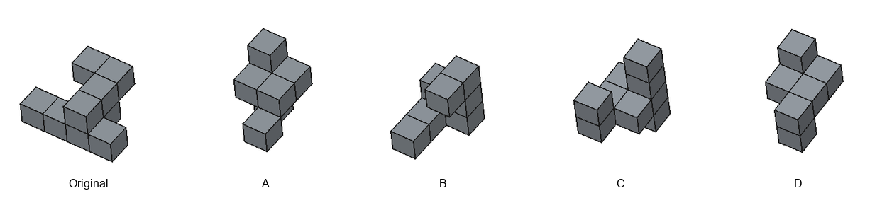

**步骤可视化**

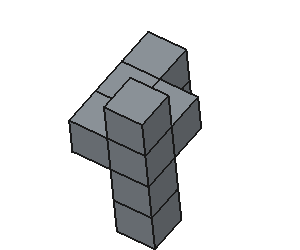
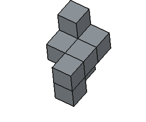

**模型生成图像**

---

## sample04950 — sample_4951

- 问题：Assuming 180-degree rotation around the Y-axis, followed by 90-degree clockwise rotation around the Z-axis, what orientation would result?
- 标准答案：A
- 模型作答：C

**模型推理文本**

> . <think>First, rotate this cube stack along the Y axis by 180 degrees. Let's generate an image to visualize the state of the object after rotation:Then, rotate this cube stack counterclockwise along the Z axis by 90 degrees. Let's visualize the current state:Comparing the final image with the options provides the reasoning: A: This option performs extra rotations beyond the required steps. B: This option performs the rotations in wrong order. C: this is the result after performing all rotation steps correctly. D: This option only performs partial rotations, missing some steps. So the final Answer is C</think>. <Answer>C</Answer>

**标准答案组合图**

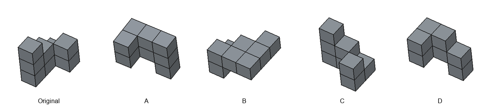

**步骤可视化**

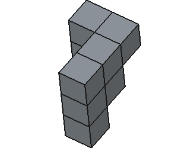
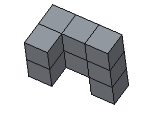

**模型生成图像**

---
