# Case Study: train 抽取10个样本

汇总了10个train集的样本上的预测情况，文字描述与对应图像交错展示。

## sample00050 — sample_0051

- 问题：Execute 90-degree clockwise rotation around the Z-axis, followed by 90-degree clockwise rotation around the Y-axis. What is the outcome?
- 标准答案：B
- 模型作答：C

**模型推理文本**

> >First, rotate this cube stack counterclockwise along the Z axis by 90 degrees. Let's generate an image to visualize the state of the object after rotation:Then, rotate this cube stack counterclockwise along the Y axis by 90 degrees. Let's visualize the current state:Comparing the final image with the options provides the reasoning: A: This option performs extra rotations beyond the required steps. B: This option performs the rotations in wrong order. C: this is the result after performing all rotation steps correctly. D: This option is missing one cube from the stack. So the final Answer is C</think>. <Answer>C</Answer>

**问题图像**

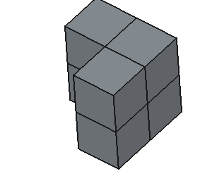

**标准答案组合图**

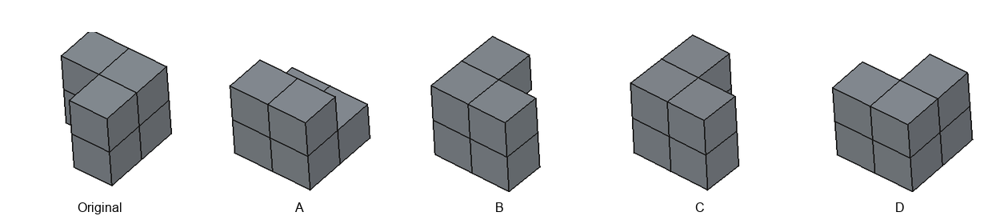

**步骤可视化**

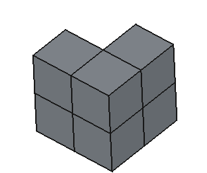
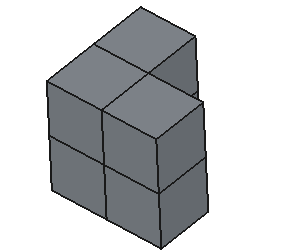

**模型生成图像**

---

## sample00100 — sample_0101

- 问题：Beginning with the default alignment, how would an object look after 270-degree clockwise rotation around the Y-axis, followed by 270-degree clockwise rotation around the Z-axis?
- 标准答案：A
- 模型作答：D

**模型推理文本**

> >First, rotate this cube stack clockwise along the Y axis by 270 degrees. Let's generate an image to visualize the state of the object after rotation:Then, rotate this cube stack clockwise along the Z axis by 270 degrees. Let's visualize the current state:Comparing the final image with the options provides the reasoning: A: This option rotates along wrong axes. B: This option performs extra rotations beyond the required steps. C: This option is missing one cube from the stack. D: this is the result after performing all rotation steps correctly. So the final Answer is D</think>. <Answer>D</Answer>

**问题图像**

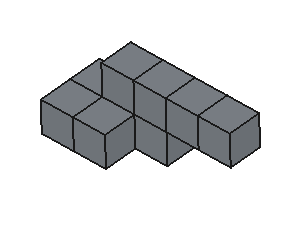

**标准答案组合图**

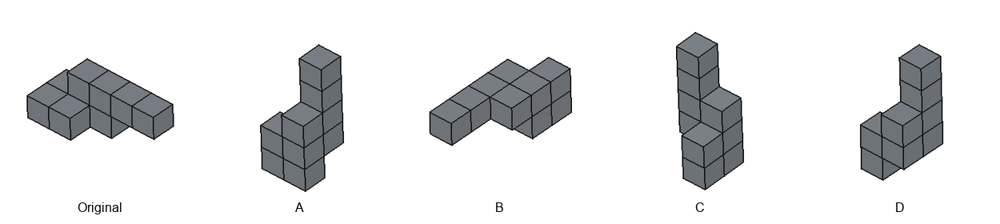

**步骤可视化**

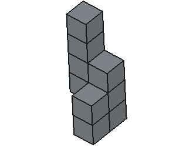
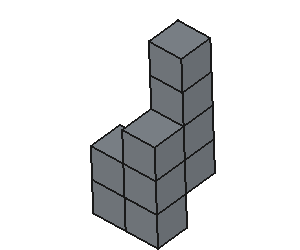

**模型生成图像**

---

## sample00150 — sample_0151

- 问题：How would the orientation change if 90-degree clockwise rotation around the X-axis, followed by 90-degree clockwise rotation around the X-axis is applied?
- 标准答案：D
- 模型作答：C

**模型推理文本**

> >First, rotate this cube stack counterclockwise along the X axis by 90 degrees. Let's generate an image to visualize the state of the object after rotation:Then, rotate this cube stack counterclockwise along the X axis by 90 degrees. Let's visualize the current state:Comparing the final image with the options provides the reasoning: A: This option only performs partial rotations, missing some steps. B: This option rotates along wrong axes. C: this is the result after performing all rotation steps correctly. D: This option performs extra rotations beyond the required steps. So the final Answer is C</think>. <Answer>C</Answer>

**问题图像**

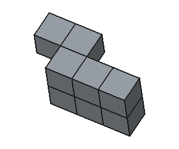

**标准答案组合图**

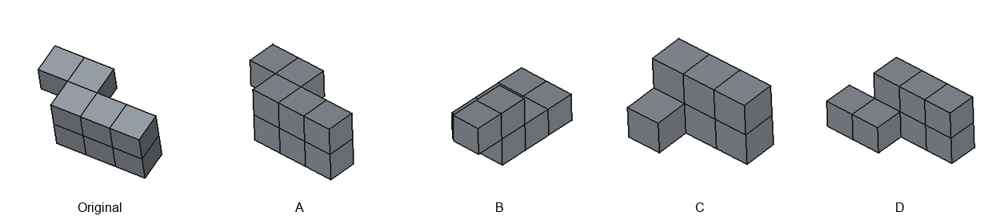

**步骤可视化**

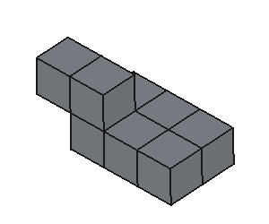
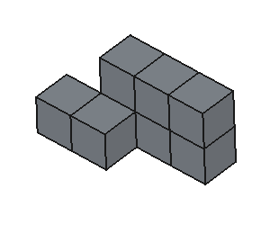

**模型生成图像**

---

## sample00200 — sample_0201

- 问题：Rotate an object according to 90-degree clockwise rotation around the Y-axis, followed by 180-degree rotation around the Z-axis. What is the result?
- 标准答案：C
- 模型作答：D

**模型推理文本**

> >First, rotate this cube stack counterclockwise along the Y axis by 90 degrees. Let's generate an image to visualize the state of the object after rotation:Then, rotate this cube stack along the Z axis by 180 degrees. Let's visualize the current state:Comparing the final image with the options provides the reasoning: A: This option performs extra rotations beyond the required steps. B: This option performs the rotations in wrong order. C: This option uses incorrect rotation angles. D: this is the result after performing all rotation steps correctly. So the final Answer is D</think>. <Answer>D</Answer>

**问题图像**

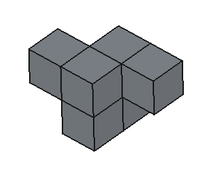

**标准答案组合图**

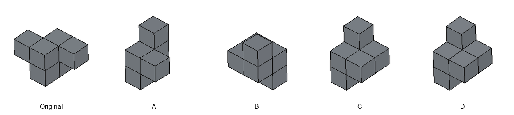

**步骤可视化**

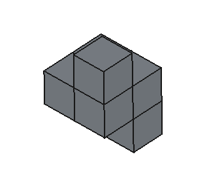
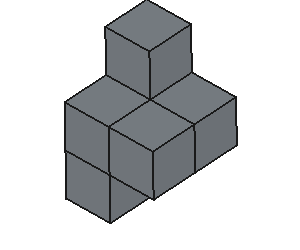

**模型生成图像**

---

## sample00250 — sample_0251

- 问题：What configuration does the object attain after 180-degree rotation around the Y-axis, followed by 180-degree rotation around the Z-axis.
- 标准答案：D
- 模型作答：D

**模型推理文本**

> >First, rotate this cube stack along the Y axis by 180 degrees. Let's generate an image to visualize the state of the object after rotation:Then, rotate this cube stack along the Z axis by 180 degrees. Let's visualize the current state:Comparing the final image with the options provides the reasoning: A: This option performs extra rotations beyond the required steps. B: This option uses incorrect rotation angles. C: This option rotates along wrong axes. D: this is the result after performing all rotation steps correctly. So the final Answer is D</think>. <Answer>D</Answer>

**问题图像**

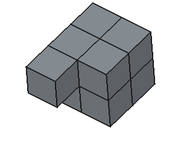

**标准答案组合图**

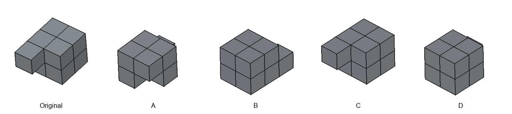

**步骤可视化**

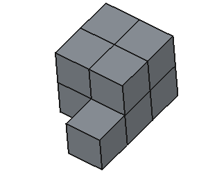
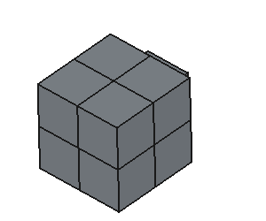

**模型生成图像**

---

## sample00300 — sample_0301

- 问题：What shape configuration follows 180-degree rotation around the X-axis, followed by 180-degree rotation around the Z-axis?
- 标准答案：A
- 模型作答：C

**模型推理文本**

> >First, rotate this cube stack along the X axis by 180 degrees. Let's generate an image to visualize the state of the object after rotation:Then, rotate this cube stack along the Z axis by 180 degrees. Let's visualize the current state:Comparing the final image with the options provides the reasoning: A: This option performs extra rotations beyond the required steps. B: This option rotates along wrong axes. C: this is the result after performing all rotation steps correctly. D: This option uses incorrect rotation angles. So the final Answer is C</think>. <Answer>C</Answer>

**问题图像**

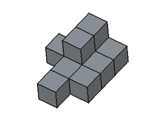

**标准答案组合图**

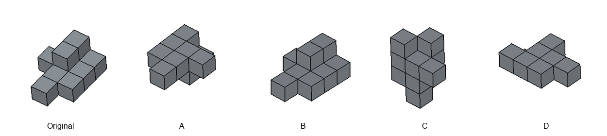

**步骤可视化**

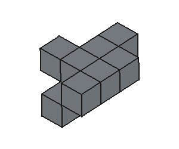
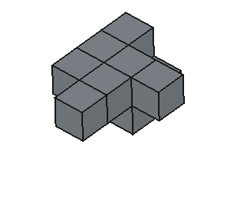

**模型生成图像**

---

## sample00350 — sample_0351

- 问题：Given the sequence of rotations 270-degree clockwise rotation around the X-axis, followed by 270-degree clockwise rotation around the Y-axis, what is the final orientation?
- 标准答案：D
- 模型作答：D

**模型推理文本**

> >First, rotate this cube stack clockwise along the X axis by 270 degrees. Let's generate an image to visualize the state of the object after rotation:Then, rotate this cube stack clockwise along the Y axis by 270 degrees. Let's visualize the current state:Comparing the final image with the options provides the reasoning: A: This option performs extra rotations beyond the required steps. B: This option performs the rotations in wrong order. C: This option only performs partial rotations, missing some steps. D: this is the result after performing all rotation steps correctly. So the final Answer is D</think>. <Answer>D</Answer>

**问题图像**

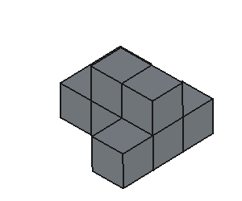

**标准答案组合图**

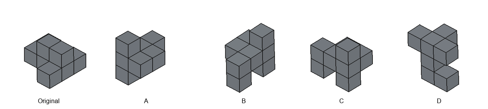

**步骤可视化**

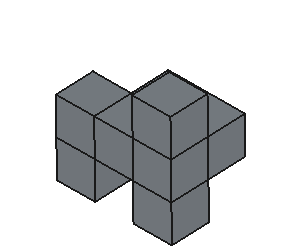
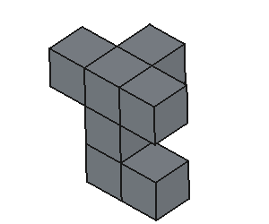

**模型生成图像**

---

## sample00400 — sample_0401

- 问题：What would be the orientation outcome of 270-degree clockwise rotation around the X-axis, followed by 90-degree clockwise rotation around the Y-axis?
- 标准答案：B
- 模型作答：C

**模型推理文本**

> >First, rotate this cube stack clockwise along the X axis by 270 degrees. Let's generate an image to visualize the state of the object after rotation:Then, rotate this cube stack counterclockwise along the Y axis by 90 degrees. Let's visualize the current state:Comparing the final image with the options provides the reasoning: A: This option performs the rotations in wrong order. B: This option uses incorrect rotation angles. C: this is the result after performing all rotation steps correctly. D: This option rotates along wrong axes. So the final Answer is C</think>. <Answer>C</Answer>

**问题图像**

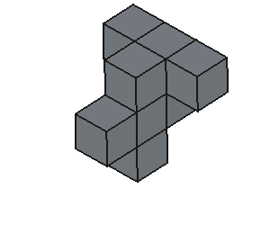

**标准答案组合图**

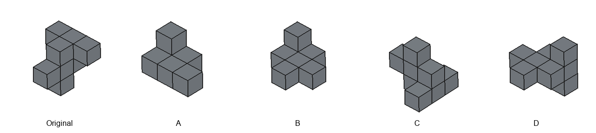

**步骤可视化**

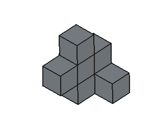
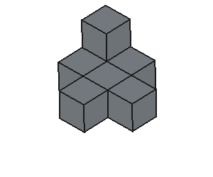

**模型生成图像**

---

## sample00450 — sample_0451

- 问题：What would the object's position be if it underwent 270-degree clockwise rotation around the Y-axis, followed by 180-degree rotation around the Z-axis?
- 标准答案：C
- 模型作答：C

**模型推理文本**

> >First, rotate this cube stack clockwise along the Y axis by 270 degrees. Let's generate an image to visualize the state of the object after rotation:Then, rotate this cube stack along the Z axis by 180 degrees. Let's visualize the current state:Comparing the final image with the options provides the reasoning: A: This option performs extra rotations beyond the required steps. B: This option performs the rotations in wrong order. C: this is the result after performing all rotation steps correctly. D: This option is missing one cube from the stack. So the final Answer is C</think>. <Answer>C</Answer>

**问题图像**

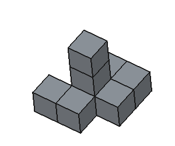

**标准答案组合图**

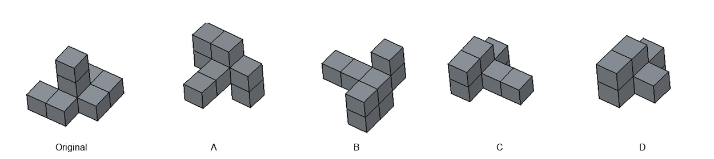

**步骤可视化**

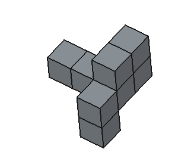
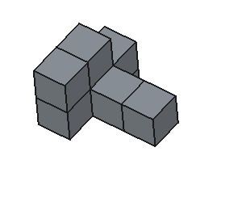

**模型生成图像**

---
